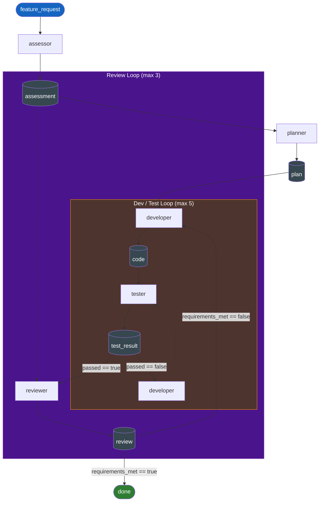

# plan-build-test workflow

## Agents

| Agent | Tools | Role |
|-------|-------|------|
| assessor | -- | Extract testable requirements from feature request |
| planner | filesystem | Create implementation plan |
| developer | shell, filesystem | Build, fix test failures, fix review feedback |
| tester | shell | Run tests, report pass/fail |
| reviewer | filesystem | Verify requirements are met |

## Data Flow

| Type | Format | Metadata |
|------|--------|----------|
| feature_request | text/plain | -- |
| assessment | text/markdown | -- |
| plan | text/markdown | -- |
| code | text/markdown | -- |
| test_result | text/plain | `passed: bool` |
| review | text/markdown | `requirements_met: bool` |
